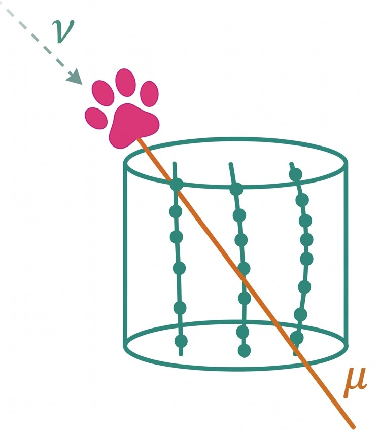

<p align="center">
  
</p>

# softpaws

[](https://github.com/MeighenBergerS/softpaws/actions/workflows/ci.yml)
[](https://meighenbergers.github.io/softpaws/)
[](https://www.python.org/)
[](LICENSE)

| | |
| --- | --- |
| Documentation | <https://meighenbergers.github.io/softpaws/> |
| Repository | <https://github.com/MeighenBergerS/softpaws> |
| Data release | [10.7910/DVN/MMIIZA](https://doi.org/10.7910/DVN/MMIIZA) |

## Summary

softpaws builds the response of a neutrino telescope from muon transport
rather than from simulation. It solves the transport of a high-energy muon
through matter, turns that solution into the volume a detector effectively
watches, and from there into an effective area, an event rate, or the energy
of a single track. The same code serves IceCube, KM3NeT/ARCA, P-ONE, TRIDENT
and Baikal-GVD, because nothing in the construction is specific to one site.

A published effective area is a Monte-Carlo product: it says what a detector
sees but not why, and it cannot be carried to a detector that has not been
simulated. softpaws computes the same quantity from the loss kernel of the
medium, the neutrino cross section, the geometry of the instrumented volume,
and two numbers per site that the instrument sets, a selection threshold and
a light reach. That makes it possible to reproduce a published table and see
which ingredient carries each feature, to predict the response of a detector
that has none yet, and to ask what a measurement would look like under a
different loss model.

## Installation

```sh
pip install git+https://github.com/MeighenBergerS/softpaws.git
```

Requires Python 3.11 or later. The optional extras `atm` (MCEq, for the
atmospheric background), `transport` (PROPOSAL, for regenerating the loss
tables) and `dev` cover the heavier dependencies. See the
[installation guide](https://meighenbergers.github.io/softpaws/installation/).

## A first calculation

```python
import numpy as np
from softpaws.detectors import ICECUBE
from softpaws.response.declination import directional_effective_area_cm2

aeff = directional_effective_area_cm2(
    ICECUBE, np.array([-0.5]), threshold_gev=1.0e3, log10_e=np.array([5.0, 6.0])
)
print(aeff[:, 0])       # [1.38e+06 3.60e+06] cm^2, at 100 TeV and 1 PeV
```

The [quickstart](https://meighenbergers.github.io/softpaws/quickstart/) takes
this to a point-source ceiling in five calls.

## Data

The tabulated inputs ship with the package: the muon loss coefficients, the
BGR18 cross section, and the published effective areas of KM3NeT/ARCA, P-ONE
and TRIDENT. The two IceCube releases are large and are not included. Download
the IceTracks-DR2 release
([10.7910/DVN/MMIIZA](https://doi.org/10.7910/DVN/MMIIZA); paper
[arXiv:2605.19040](https://arxiv.org/abs/2605.19040)) and, if you need the
starting-event comparison, the HESE 7.5-year release. Place them under the
package's `data` directory or set `SOFTPAWS_DATA_DIR`; the expected layout is
in the [data guide](https://meighenbergers.github.io/softpaws/data/).

## Layout

```
src/softpaws/
├── transport/     Loss kernel, transport exponent, ranges, Earth, tau channel
├── detectors/     Published geometry, medium and optics per site
├── fluxes/        Power laws, the published fits, the atmospheric background
├── response/      Effective areas: light reach, first principles, declination
├── comparison/    Likelihoods, posteriors, the event benchmark, event energies
├── data/          Loaders for the IceCube release and the published curves
└── utils/         Constants and unit conversions
examples/          Twelve tutorials, 01 to 12; output in examples/output/
scripts/
├── 2026_muon_transport/   One script per paper figure, table and number
└── future_bsm/            Searches that belong to a later paper
tests/             Unit tests and the regression fixture the paper is pinned to
docs/              The documentation site
```

## Citation

If softpaws is useful in your work, please cite the method paper and the
inputs your analysis relies on; the list is in the
[citation guide](https://meighenbergers.github.io/softpaws/citation/).

```txt
@article{MeighenBerger:softpaws,
  author  = {Meighen-Berger, Stephan A.},
  title   = {{Analytical High-Energy Muon Transport for Neutrino Telescopes}},
  year    = {2026},
}
```

The entry is updated with the arXiv number and the journal reference once
they exist.

## Contributing

See [CONTRIBUTING.md](CONTRIBUTING.md) and
[CODE_OF_CONDUCT.md](CODE_OF_CONDUCT.md).

## Getting help

Open an [issue](https://github.com/MeighenBergerS/softpaws/issues) for a bug
or a feature request, or start a
[discussion](https://github.com/MeighenBergerS/softpaws/discussions) for a
question.

## License

GPL-3.0-or-later; see [LICENSE](LICENSE).
